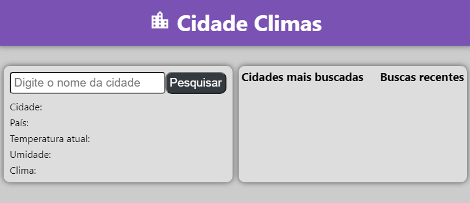
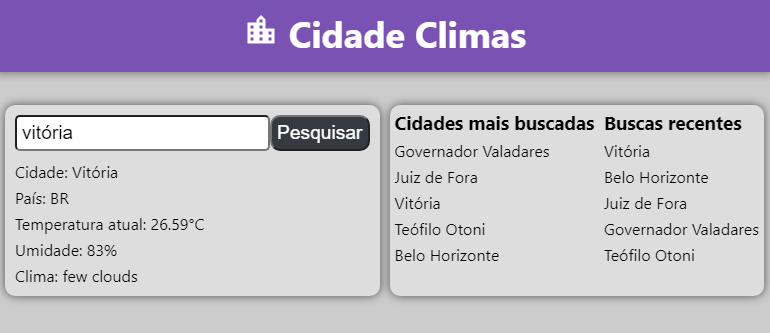

# challenge_tech4h
<h2>Sobre o projeto</h2>
É um projeto que busca a armazena informações climáticas sobre determinadas cidades.
A aplicação consiste em 2 painéis: o da esquerda mostra as informações sobre a cidade buscada no formulário; e o da direita exibe 2 listas: uma listando as cidades mais buscadas, e a outra as mais recentemente pesquisadas.   

Aplicação com banco de dados vazio  
</img>  

Aplicação com cidades pesquisadas  
</img>  

<h3>Tecnologia usadas</h3>
Para o backend, foram usadas: NodeJS, ExpxessJS, SequelizeORM.  
Para o frontend, foram usadas: ReactJS.   
Banco de dados usado: PostgreSQL.   

# Instruções para a execução do projeto. 
OBS: O Node e o PostgresSQL devem estar instalados na máquina onde será executado o projeto.

1º passo - Com o PostgresSQL em execução, crie um banco onde serão salvas as informações referentes às cidades.

2º passo - Preencha o arquivo .env que está dentro da pasta backend com todas as informações que pedem lá, colocando o valor logo após o sinal de igualdade, sem aspas. Que são:  DB_USER - o nome do usuário do banco de dados  
DB_PASSWORD - a senha do banco de dados  
DB_PORT - a porta onde seu banco está ounvido as requisições  
DB_DBNAME - o nome do banco que usará para salvar os dados (criado no passo anterior)  
TOKENAPI - o token de api que você pode criar gratuitamente, e está disponível no endereço https://home.openweathermap.org/api_keys, desde que você esteja logado no site.  

3º passo - Instale as dependências do projeto, com o comando 'npm i' em um terminal aberto na pasta raiz do projeto, e execute o comando novamente dentro da pasta backend.

4º passo - Para executar o projeto completo, você irá precisar de 2 abas de terminal (prompt, powershell, ou qualquer outro), uma delas para executar a parte de backend e outro para o frontend.

5º passo - Em uma das abas do terminal, entre na pasta backend dentro do proejeto (com o comando 'cd backend', sem aspas), e execute o comando 'npm start', sem aspas.

6º passo - Depois que aparecer a mensagem 'servidor executando na porta 4000', vá para o outro terminal dentro da pasta raiz do projeto, que é a challenge_tech4h, e execute 'npm start' para que o frontend seja executado. (certifique-se de que as portas 4000 e 3000 já não estão sendo usadas por outra aplicação)

7º passo - Aguarde até que a interface seja exibida, logo após, é só usar a aplicação.
